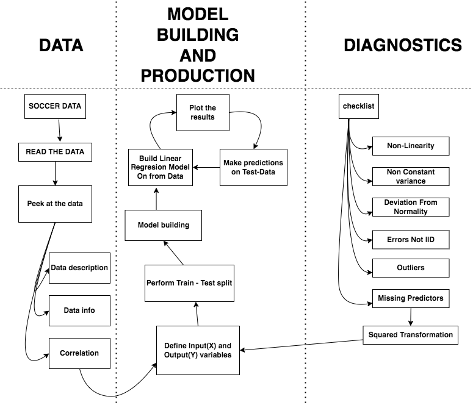

# linear regresion with python

## Project Overview

At the intersection of cutting-edge innovation and the magnetic allure of the English Premier League (EPL), a Machine Learning Engineering odyssey unfolds. With a global audience of 12 million per match, the EPL beckons as a canvas for transformative insights through Analytics and Artificial Intelligence (AI). In this symphony of data and soccer, Machine Learning Engineers unite algorithms and strategies, crafting predictive models to elevate player analysis, strategic decisions, and risk management. Anchored by the stalwart Regression technique, particularly Linear Regression, our expedition navigates uncharted territories to forecast EPL soccer scores. Seamlessly weaving business insight, our focus pivots to the technical arena. Here, we dissect methodologies, architect pipelines, and refine models, orchestrating an exquisite interplay of data, algorithms, and ingenuity. As the unpredictable spirit of soccer converges with quantifiable patterns, Machine Learning Engineering emerges as both the brushstroke and canvas of this captivating journey.

## Project Goals

## Services we will be using

## Dataset Used

## Architecture Diagram

## Complete Tutorial
I have created a detailed notebook tutorial for this project, where you will execute everything from start to end.
